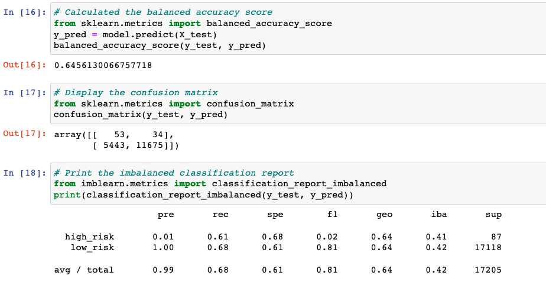
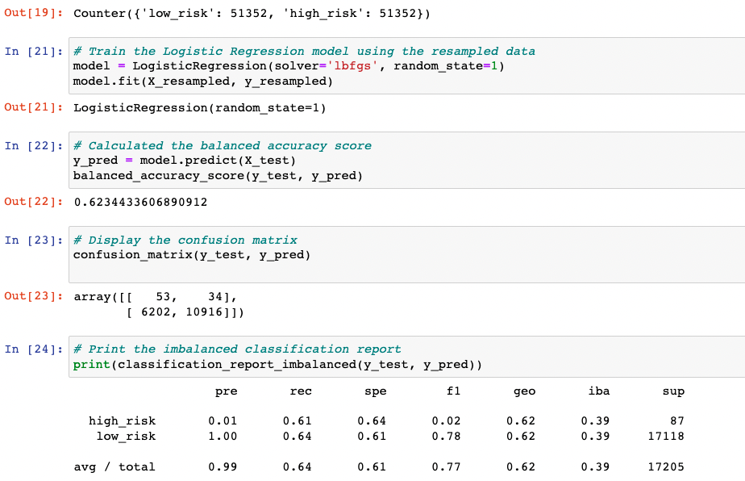
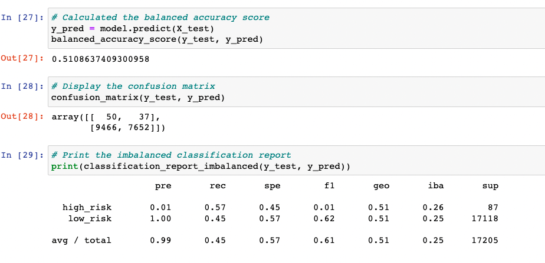
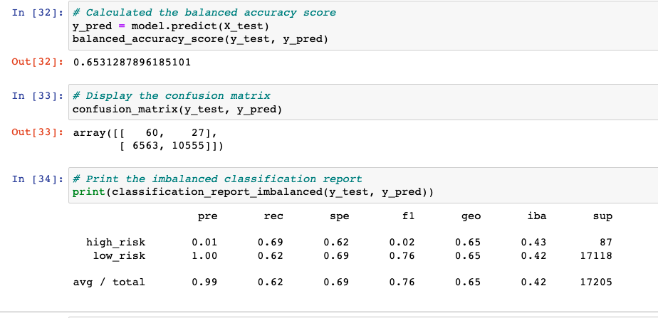
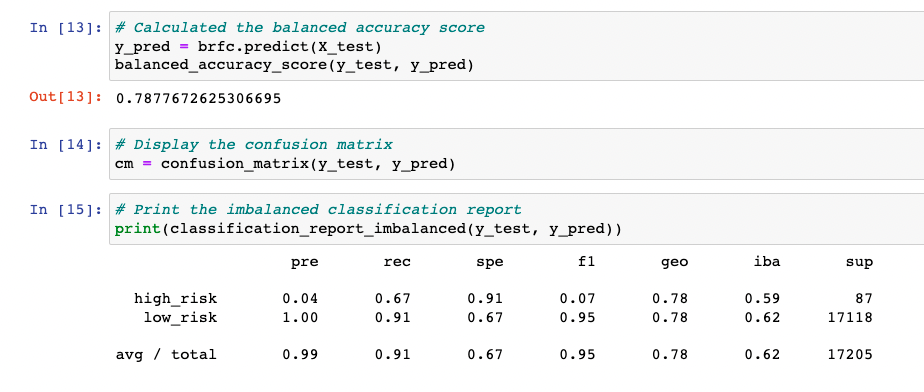
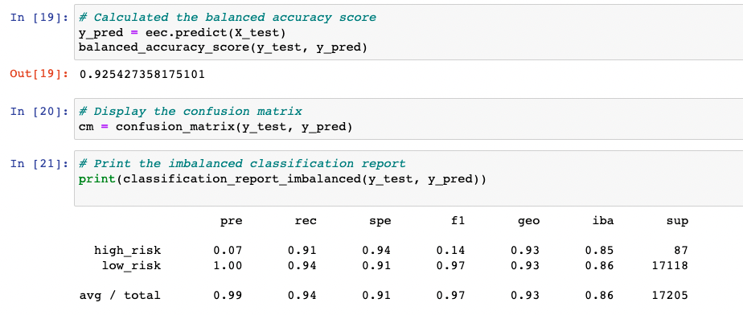

# Credit_Risk_Analysis
## Overview
The purpose of this project is to help LendingClub " peer-to-peer lending services company." We are going to do this by setting up different machine learning models that evalutes individual customer credit risk.
## Results
The machine learning algorithms used were:

RandomOverSampler
SMOTE
ClusterCentroids
SMOTEENN
BalancedRandomForestClassifier
EasyEnsembleClassifier
The models were run and then evaluated for performance and accuracy at predicting credit risk.

### Naive Random Oversampling

### SMOTE Oversampling

### ClusterCentroids Undersampling

### Combination Sampling

### BancedRandomForestClassifer

### EasyEnsembleClassifer

## Sumarry
In the end when we used all thes models none of the performed as well as we would have liked. In the model there were a high number of false positves that would have maked good guest as high risk. This does not just hurt LendingClub it also hurst the customer. I think the best way to go about it is just use multiple plus others to make sure they are giving the loans to the right people.
